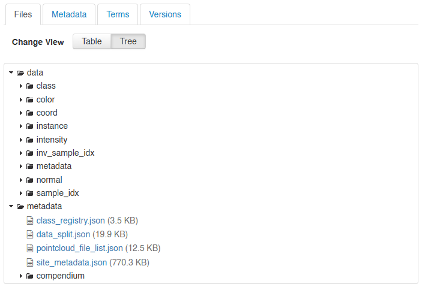
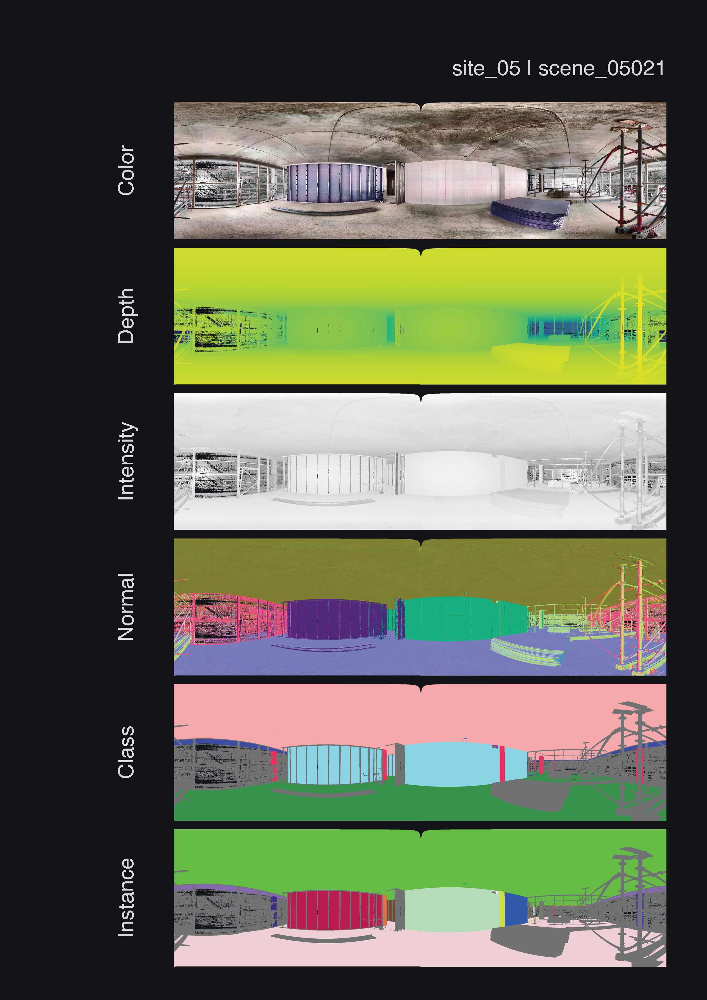

# Rohbau3D
A Shell Construction Site 3D Point Cloud Dataset

<p align="center">
  
</p>
<p align="center"><em>Figure: Rohbau3D point cloud feature maps</em></p>

## Abstract

**Rohbau3D** is a dataset of real-world indoor construction environments represented by high-resolution 3D point clouds. It comprises **504 LiDAR scans** captured with a terrestrial laser scanner across **14 distinct construction sites**, including residential buildings, a large-scale office complex, educational facilities, and an underground parking garage, all in various stages of shell construction or renovation. Each point cloud is enriched with scalar **laser reflection intensity**, **RGB color** values, and reconstructed **surface normal vectors**. In addition to the native 3D data, the dataset includes high-resolution 2D panoramic renderings of each scene and its associated point cloud features.

The latest release further extends Rohbau3D with dense **point-wise semantic class labels** and **instance annotations** for the point clouds, together with corresponding projected annotations in the panoramic renderings. The semantic taxonomy comprises 17 foreground classes and one background class, covering structurally relevant and frequently occurring object categories in shell construction environments. These annotations enable research on semantic segmentation, instance-level scene understanding, and object-wise analysis of real construction-site data.

Designed to reflect the complexity and variability of real-world construction sites, Rohbau3D captures clutter, occlusions, unfinished structures, temporary installations, and characteristic sensing artifacts of terrestrial laser scanning. Rohbau3D is intended to support research in geometric processing, 3D scene understanding, and intelligent computing in structural and civil engineering, while also providing a challenging benchmark for robust perception in complex built environments.


## Highlights

* 🚀 **Rohbau3D-Semantics**: Dense Semantic and Instance Labels for Indoor Shell Construction Scenes


## Publications
:page_facing_up: [Rohbau3D: A Shell Construction Site 3D Point Cloud Dataset](https://www.nature.com/articles/s41597-025-05827-7)


## Overview 

- [Rohbau3D](#rohbau3d)
  - [Abstract](#abstract)
  - [Highlights](#highlights)
  - [Publications](#publications)
  - [Overview](#overview)
  - [Data Records](#data-records)
    - [The Scope Of The Data](#the-scope-of-the-data)
    - [The Dataset Structure](#the-dataset-structure)
  - [Installation](#installation)
    - [Requirements](#requirements)
    - [Clone Repository](#clone-repository)
    - [Conda Environment](#conda-environment)
  - [Download and Extract the Point Cloud Data](#download-and-extract-the-point-cloud-data)
  - [Download Feature-Overview Compendium Files](#download-feature-overview-compendium-files)
  - [Rendering Panorama Images and Cube-Maps from the Point Clouds](#rendering-panorama-images-and-cube-maps-from-the-point-clouds)
  - [Citation](#citation)
  - [Acknowledgement](#acknowledgement)


## Data Records

The Rohbau3D data records can be summarized as a medium-scale repository of terrestrial laser scan point clouds covering static scenes from a wide variety of shell construction sides. The records include the spatial coordinates annotated with the sensor-specific (1) RGB color, (2) surface reflection intensity information, (3) the reconstruction of surface normal vectors, and (4) panoramic 2D image representations of all feature spaces. 

With the latest contribution, Rohbau3D-Semantics finally features high-quality point-wise semantic class and instance annotations. 


### The Scope Of The Data

The repository contains in total a set of 504 scenes captured in one of 14 different building environments.


File ID    | Acquisition Site Overview
-----------|--------------------------
site_000   | Multi-story apartment block with small to medium-sized rooms in brick wall construction. Some walls plastered, some exposed. Windows present; no doors. Floor mostly dry.
site_001   | Multi-story apartment block with small to medium-sized rooms. Sloping ceilings, brick wall construction, walls partially plastered. Windows present; no doors. Floor mostly dry.
site_002   | Reinforced concrete underground parking structure with low to high ceilings and column grid. Poor lighting. Water puddles on floor.
site_003   | Multi-story school building with large rooms. Reinforced concrete skeleton construction. Good lighting. Water puddles on floor.
site_004   | Large hall in reinforced concrete with round ceiling elements. Large floor opening. No facade installed.
site_005   | Multi-story school building with rooms of varying sizes. Drywall partitions. Semi-transparent temporary facade covering.
site_006   | Multi-story school building with medium to large rooms. Drywall partitions in some areas. Open facade surfaces. Technical equipment installed on ceilings.
site_007   | Large hall with high ceiling. Reinforced concrete construction.
site_008   | Multi-story office building with small to large rooms and freestanding drywall supports. Glazed facade installed. Technical equipment on ceilings installed.
site_009\* | Multi-story brick building under renovation. Historic features. Small rooms and narrow staircases. Windows present; no doors. Poor lighting.
site_010\* | Vaulted cellar of brick structure. Small rooms. Uneven floors. Poor lighting.
site_011   | Two-story structure with basement. Mixed brick and precast concrete construction. Small to medium rooms. Water on floors. Poor lighting.
site_012   | Multi-story apartment block with basement. Reinforced concrete prefabricated construction. Large window and door openings. Some scenes contain water on the floor and show poor lighting.
site_013\* | Multi-story brick building under renovation. Small rooms connected by corridors. Walls partly plastered, partly exposed. Mostly clean floors.            

--------------------------------------
*Renovation sites are indicated with an asterisk (\*).*


### The Dataset Structure
```
rohbau3d
|-- metadata
|   |-- class_registry.json
|   |-- data_split.json
|   |-- pointcloud_file_list.json
|   |-- site_metadata.json
|   |-- panorama
|       |-- features
|           |-- site_00.panorama.features.pdf
|           |-- site_01.panorama.features.pdf
|           |-- site_03.panorama.features.pdf
|           |-- ...
|
|-- site_00
|   |-- scan_00000
|   |   |-- coord.npy
|   |   |-- color.npy
|   |   |-- intensity.npy
|   |   |-- normal.npy
|   |   |-- class.npy
|   |   |-- instance.npy
|   |   |-- sample_idx.npy
|   |   |-- inv_sample_idx.npy
|   |   |-- panorama (*)
|   |   |   |-- depth.png
|   |   |   |-- depth.npy
|   |   |   |-- color.png
|   |   |   |-- normal.png
|   |   |   |-- intensity.png
|   |   |   |-- class.png
|   |   |   |-- class_id.png
|   |   |   |-- instance.png
|   |   |   '-- instance_id.png
|   |   |
|   |   |-- cube_map (*)
|   |   |   |-- depth_neg_x.png
|   |   |   |-- depth_neg_y.png
|   |   |   |-- depth_neg_z.png
|   |   |   |-- depth_pos_x.png
|   |   |   |-- depth_pos_y.png
|   |   |   |-- depth_pos_z.png
|   |   |   |-- color_neg_x.png
|   |   |   |-- color_{...} 
|   |   |   |-- intensity_{...} 
|   |   |   |-- normal_{...} 
|   |   |   |-- class_{...} 
|   |   |   '-- instance_{...} 
|   |   
|   |-- scan_00001
|   |-- scan_00002
|   '-- ...
|
|-- site_01
|   |-- scan_01000
|   '-- ...
|
... 
'-- site_13
```
> (*) Panorama- and Cube-Map-Image files are _not_ downloadable but can be rendered locally from the 3D data.


## Installation
   
### Requirements
* git 
* numpy
* pooch
* tqdm
* yaml
* zstandard

### Clone Repository
Clone the Rohbau3D Repository to a local space. 

```bash
git clone https://github.com/RauchLukas/Rohbau3D.git
```

### Conda Environment
Manually create a conda environment and install the package

```bash
conda create -n rohbau3d python=3.11 -y
conda activate rohbau3d

cd Rohbau3D
pip install .
```

## Download and Extract the Point Cloud Data 

The point cloud dataset can be directly downloaded in chunks from Dataverse @ OpenData UniBw M: 

* Download Link: [https://open-data.unibw.de/dataset](https://open-data.unibw.de/dataset.xhtml?persistentId=doi:10.60776/ZWJFI4)

> Recommended: Use the Tree Structure View to navigate the dataset.

<p align="center">
  <a href="https://open-data.unibw.de/dataset.xhtml?persistentId=doi:10.60776/ZWJFI4&version=DRAFT" target="_blank" rel="noopener noreferrer">
    
  </a>
</p>
<p align="center">
  <em><a href="https://open-data.unibw.de/dataset.xhtml?persistentId=doi:10.60776/ZWJFI4&version=DRAFT" target="_blank" rel="noopener noreferrer">OpenData Data Tree</a></em>
</p>


Conveniently, this repository offers also the option of downloading the entire dataset or individual pieces using scripts. [**RECOMMENDED**]


**Short Version:**
  
Inside the `Rohbau3D` folder, run the `scripts/download.py` script to download all dataset point cloud files. 

```bash
python scripts/download.py --config config/dataverse.yaml --download --extract
```

**Options:**    
- `--config` [required] : set the path to the configuration script.    
- `--download` [optional] : Flag to enable download. Default=False.    
- `--extract` [optional] : Flag to enable file extraction. Default=True.
<br/><br/>


**Manual Configuration:**

  Customize the configuration inside the `config/dataverse.yaml` file:     

```yaml
# CONFIGURATION
# Rohbau3D

# GENERAL
config_dir: config
log_dir: log
log_level: INFO

# DOWNLOAD
download_hub: dataverse
download_dir: data/download
feature_index_file: dataverse_file_index.json
feature_selection: [all]
scene_selection: [all]

# FILE EXTRACT
extract_dir: data/extract
clean_download_files: False
```

**Options:**

- `config_dir` : Set the *path/to/the/configuration/files* location.
- `log_dir`: Set the logging *path/to/the/logging* location.
- `log_level` : Set the logging Level. 
- `download_hub`: Set the download server / hub. [Allowed options: `dataverse` and `default`]
  > *Note: At the moment, the data can only be downloaded from Dataverse [https://open-data.unibw.de/](https://open-data.unibw.de/)*. 
- `download_dir` : Set the *path/to/the/download* location. 
- `feature_index_file` : Name the content index file for the download hub. 
- `feature_selection` : Select the point cloud features to download as a `list`. Options include: 
  - `all` : selects all available point cloud features. 
  - `coord` : the xyz coordinates. 
  - `color` : the RGB color annotation. 
  - `intensity` : the LiDAR reflection intensity annotation. 
  - `normal` : the reconstructed surface normal annotation. 
  - `class` : the class semantic segment annotation number (one out of 18 [int]).
  - `instance` : the instance segment annotation id (arbitrarily continued number [int])
  - `sample_idx` : index list to sample the raw data to a maximum of 15 million (15M) points. 
  - `inv_sample_idx` : index list to reverse the 15M subsampling 
  - `metadata` : redundant metadata `.json` file at the scene level containing annotation information for all instances. 
- `extract_dir` : Set the *path/to/the/file/extraction* location. 
- `clean_download_files` : Set the Flag `True`, `False` to delete the download directory at the end of the script. 

## Download Feature-Overview Compendium Files

To give you a quick overview of all scenes, we provide a compendium in .pdf format for each acquisition site, with a rendered panoramic view of all point cloud features. 

<p align="center">
  
</p>
<p align="center"><em>Example site feature compendium.</em></p>


You can either manually download the feature.pdf files by searching the Rohbau3D dataset for `"site_{site_number}.panorama.features.pdf"`on [Dataverse @ Open Data UniBw Munich](https://open-data.unibw.de/dataset.xhtml?persistentId=doi:10.60776/ZWJFI4).


Or you can download all files directly by using the `download_features.py` script via the Dataverse API from inside the Rohbau3D repository: 

```bash 
# Download all feature compendiums
python scripts/download_features.py --dir path/to/download/directory
```

**Options:**

- `--dir` : Set the local *path/to/the/download* location.


## Rendering Panorama Images and Cube-Maps from the Point Clouds

We provide a method to render panoramic images directly from the point cloud for all available features. 
The script creates RGBA images of shape (u, v, 4). Empty pixels are set to transparent (opacity=0). 

Use the `render_projections.py` from inside the Rohbau3D repository to render the images locally. 

Inside the `Rohbau3D` folder, run the `scripts/render_projections.py` script to render all panoramas and cube-maps for available features. 


```bash
python scripts/render_projections.py --config config/render_projections.yaml
```

**Options:** 
- `--config` [optional] : set the path to the configuration script. Default=_'config/render_projections.yaml'_.
<br/><br/>
 
**Manual Configuration:**

Customize the configuration inside the `config/render_projections.yaml` file:     

```yaml
# CONFIGURATION
# Rohbau3D

# PATHS
data:
  root: data/extract
output:
  root: data/renderings

# 
selection:
  # Use null to process all available sites/scenes.
  # Example for single scene:
  # site: site_01
  # scene: scene_01000
  site: null   # null | all | [site_01, site_02, ...]
  scene: null  # null | all | [scene_01001, scene_06069]

render:
  panorama: true
  cube_map: true
  # Available: color, depth, intensity, normal, class, instance
  features: [color, depth, intensity, normal, class, instance]
  parallel:
    backend: process   # serial | process | thread
    workers: 12         # 1 = no parallelism, 0 or auto = os.cpu_count()

panorama:
  width: 4096
  height: 2048

cube_map:
  size: 1024
```

**Options:**

- `site` : select the site folders to render. Options: null | all (to render all available sites) | [site_{_site_id_}, site_{_site_id_}] (to render a list of selected sites).
- `scene` : select the explicit scenes to render. Options: null | all (to render all available scenes) | [scene_{_site_id_}{_scene_id_}, ... ] (to render a list of selected scenes).
- `panorama` : set Flag `true`or `false` to toggle panorama rendering.
- `cube_map` : set Flag `true` or `false` to toggle Cube-Map rendering.
- `features` : select the list of Features to render. Options: [color, depth, intensity, normal, class, instance].
- `backend` : select `serial` for single core processing. Select `process` for parallelized processing. 
- `workers` : select the number of cores for parallel rendering.
- `width` & `height` : define the panorama image resolution.
- `size` : define the quadratic Cube-Map image size. 


## Citation

If you find our work useful in your research, please cite our paper:

```
@article{rauch.2025.Rohbau3D,
  title = {Rohbau3D: A Shell Construction Site 3D Point Cloud Dataset},
  shorttitle = {Rohbau3D},
  author = {Rauch, Lukas and Braml, Thomas},
  year = {2025},
  journal = {Scientific Data},
  volume = {12},
  number = {1},
  pages = {1478},
  publisher = {Nature Publishing Group},
  issn = {2052-4463},
  doi = {10.1038/s41597-025-05827-7},
}
```


## Acknowledgement
The surface normal estimation in this repo is based on/inspired by great works, including but not limited to:   
[SHS-Net](https://github.com/LeoQLi/SHS-Net) 
 
